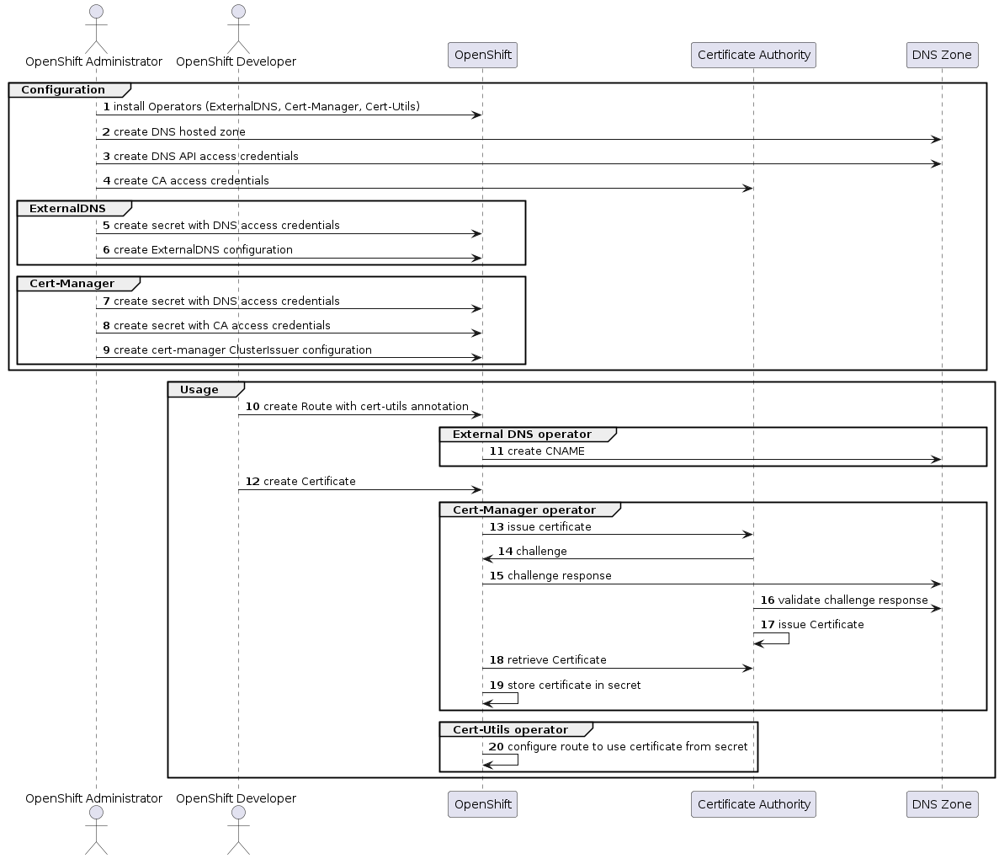

# winkelschleifer
Google  microservice addition

# winkelschleifer
Google  microservice addition

## Deploy microservices-demo on ROSA
### Prepare ROSA environment
Install CLI Tools, e.g. on macos via homebrew:

* brew install openshift-cli
* brew install aws-cli
* brew install rosa-cli

### Set up ROSA 
→ follow the console.redhat.com instructions

```
rosa create cluster --cluster-name winkelschleifer --sts --role-arn arn:aws:iam::226507396508:role/ManagedOpenShift-Installer-Role --support-role-arn arn:aws:iam::226507396508:role/ManagedOpenShift-Support-Role --controlplane-iam-role arn:aws:iam::226507396508:role/ManagedOpenShift-ControlPlane-Role --worker-iam-role arn:aws:iam::226507396508:role/ManagedOpenShift-Worker-Role --operator-roles-prefix winkelschleifer-s5c8 --region eu-central-1 --version 4.11.18 --compute-nodes 2 --compute-machine-type m5.xlarge --machine-cidr 10.0.0.0/16 --service-cidr 172.30.0.0/16 --pod-cidr 10.128.0.0/14 --host-prefix 23 --etcd-encryption
```

Check the cluster status on console.redhat.com
You might need to add some details manually:


**ROSA installation:** https://console-openshift-console.apps.winkelschleifer.wbcq.p1.openshiftapps.com

## Configure Google Auth
https://examples.openshift.pub/cluster-configuration/authentication/redhat-sso/  


### Create a new project


### Add OAuth Client Ids


## Add Google OAuth as identity provider

```
rosa create idp --type=google --client-id=626307336472-mrtf4suln41vs30oop1gbb92qmlb57it.apps.googleusercontent.com --client-secret=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 --mapping-method=claim --hosted-domain=redhat.com --cluster=winkelschleifer --name=Google-RedHat
```

### Add Users to dedicated admin role
Add dedicated users which login via Google ID to the local group of cluster admins

```
rosa grant user dedicated-admin --user=wrichter@redhat.com --cluster=winkelschleifer
```

# Deploy Application
Locally clone the Google project

```
git clone https://github.com/GoogleCloudPlatform/microservices-demo
```

## Create new project in ROSA
The Red Hat OpenShift cluster you create here will be base of our following activities

```
oc new-project microservices-demo
```

## Deploy Application

This is done in order to execute a deployment of Google Code As-Is. Current deployments use the following security contexts - we need to make arrangements that those settings are valid in our cluster too.

To be found in microservices-demo/release/kubernetes-manifest.yaml

```
securityContext:
        fsGroup: 1000
        runAsGroup: 1000
        runAsNonRoot: true
        runAsUser: 1000
```

Based on this article: https://examples.openshift.pub/deploy/scc-anyuid/ 

### Option 1: Give ANYUID permissions to default service account

Add the proper Role
```
oc create -f static/release_security_role.json
```
Add the related RoleBinding
```
oc create -f static/release_security_rolebonding.json
```
And use the original kubernetes manifest

```
oc apply -f ./release/kubernetes-manifests.yaml
```

### Option 2: Remove SecurityContext & Deploy application

This makes the default OpenShift SCC config work

```
for DEPLOY in `oc get deployments -o jsonpath='{range .items[*]}{.metadata.name}{" "}{end}'`
do
 oc patch deploy/$DEPLOY --type=json -p='[{"op": "remove", "path": "/spec/template/spec/securityContext"}]'
done
```

# Overview of the installation flow



## 1 Install Operators and basic confiuration(s)

( ExternalDNS, cert-manager, cert-utils)


## 2 Create DNS hosted zone

## 3 Create DNS API access credentials

## 4 Create CA access credentials

## ExternalDNS config


### 5 create secret with DNS access credentials

### 6 create ExternalDNS configuration

## Cert-Manager


### 7 create secret with DNS access credentials

### 8 create secret with CA access credentials

### 9 create cert-manager Clusteruser configuration

