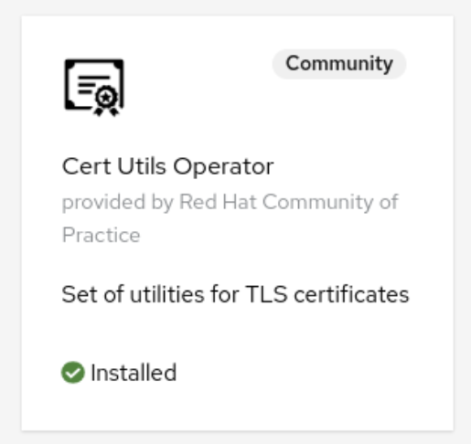
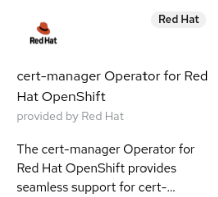
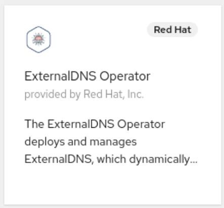
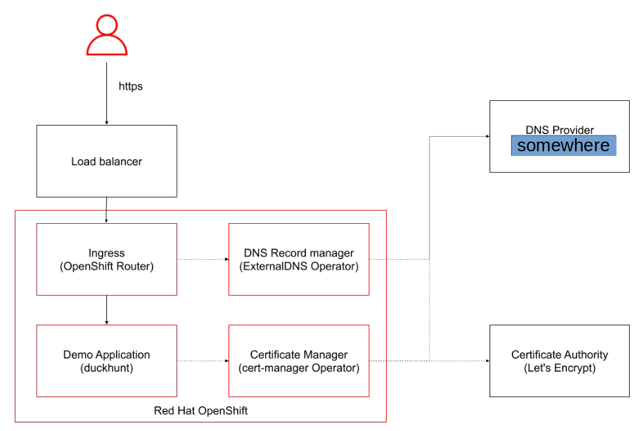
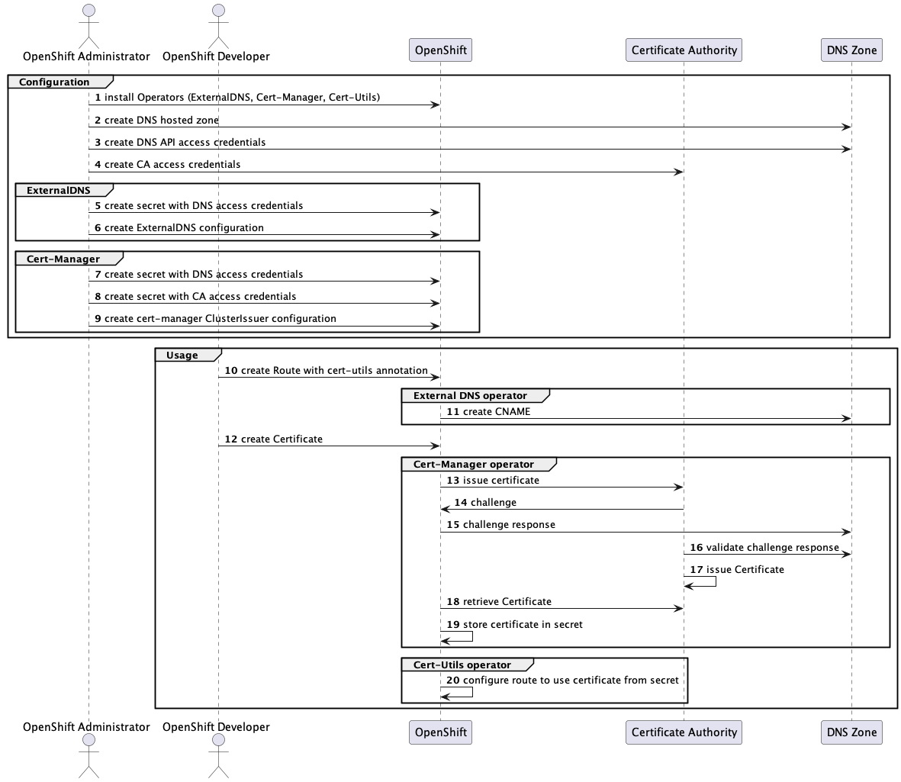
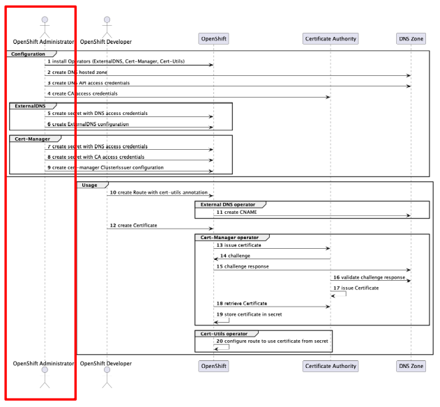
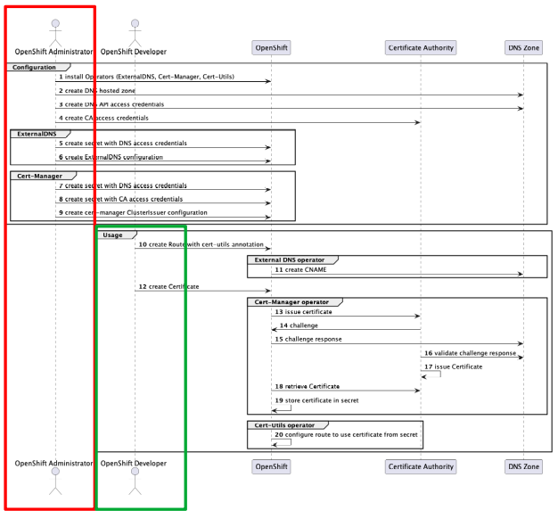

# A little bit of security is what I want

Segregation of duties - how a Kubernetes Management Platform adds security to your roll outs

## Introduction

Based on Stefan's post [1] [Configuring custom domains for applications – the operator-way](https://www.opensourcerers.org/2022/12/12/configuring-custom-domains-for-applications-the-operator-way/) in December, some of us felt inspired to replay what Stefan outlined.

Main topics we wanted to cover:
* Utilize a custom domain name for a project
* Utilize a Kubernetes management platform [K8s]
* Leave all certificate handling with the K8s platform
* Be able to create new projects leveraging the certification and DNS handling with a minimum effort

And as Red Hat employees the K8s management platform choice is more than obvious. We decided for Red Hat OpenShift as a base for the next steps. The concept of operators (see [2]) is used and referenced in Stefan's post.

## The Operators

---

While reading through the post [1] you come across three operators which will be used and they are listed below:

[//]:
[//]:
[//]:

---

## Starting point

We - like everybody else - all started with the below workflow

1. Deploy a managed Red Hat OpenShift platform in either AWS or Azure or Google
2. Configure an authentication provider to utilize the on-board multi tenant capabilites of Red Hat OpenShift
3. Install the three operators ( cert utils, external DNS managament and cert manager)
4. Deploy the example application
5. Expose the application with a secure, custom domain name

 

And here we made a change to the details in [1], when we started to utilize a domain hosted "somewhere". In order to do so we had to ask for help from the outside. We had to ask a colleague with admin access of this domain for help to make adjustments to the DNS records. In the following flow the externalDNS Operator will need access to the DNS record configuration.

## The who-does-what

**At this point we started to discuss security aspects of our workflow**

And to make ourselves aware of the risks we draw a picture of who does what in our deployment.

The below picture illustrates the flow of things in our Red Hat Openshift environment
+ Roles
  + OpenShift Administrator [has administrative rights in a cluster (aka cluster admin)]
  + OpenShift Developer [Has only limited rights which are mostly restricted to our project]
+ Instances
  + OpenShift [Kubernetes Management Platform]
  + Certificate Authority [CA - [we used Let's Encrypt](https://en.wikipedia.org/wiki/Let's_Encrypt)]
  + DNS Zone [Administrative access to manage on subdomain level]
+ Tasks
  + Configuration [Admin tasks prior to the instalation]
  + ExternalDNS [Tasks executed by the ExternalDNS Operator]
  + Cert-Manager [Tasks executed by the cert-manager Operator]
+ Usage [Separated block of activities which are executed and orchestrated by the operators during runtime]

## How security plays along

There are two major blocks of activities which need to happen.

First - the **administrative ones** which need to be executed with additional rights and are mostly handled outside of application teams. Respresented by the **red box**.

Second - the **application operational ones** which are executed by application development and application operations teams in typical enterprise environments. Represented by the **green box**.

## Conclusion

## References

[1] [Configuring custom domains for applications – the operator-way](https://www.opensourcerers.org/2022/12/12/configuring-custom-domains-for-applications-the-operator-way/)

[2] [The Operator Framework](https://operatorframework.io/)